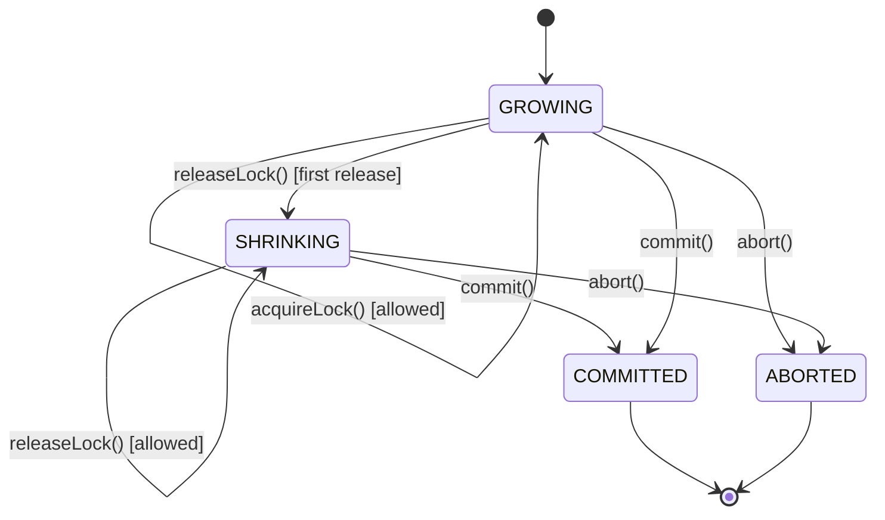

# 5. The Two-Phase Locking (2PL) Protocol

## The problem 2PL solves

Just having shared/exclusive locks (from [the previous document](04-locks-and-concurrency-control.md)) is not enough to guarantee correctness. A transaction could acquire a lock, release it, do something else, and then acquire a *different* lock, in a pattern that still lets two transactions' operations interleave in an unsafe order. **Two-Phase Locking** is a specific *discipline* about *when* a transaction is allowed to acquire versus release locks, and it is provably sufficient to guarantee **serializability** (the illusion that transactions ran one at a time, defined in [Databases and Transactions](02-databases-and-transactions.md)).

## The rule

Every transaction's lifetime is split into exactly two phases:

1. **Growing phase** — the transaction may *acquire* new locks. It may **not** release any lock during this phase.
2. **Shrinking phase** — the transaction may *release* locks. It may **not** acquire any new lock during this phase.

The moment a transaction releases its very first lock, it has permanently moved from growing to shrinking — there is no going back.



This is exactly the `TransactionState` enum in `include/transaction.h`:

```cpp
enum class TransactionState {
    GROWING,   // acquiring locks
    SHRINKING, // releasing locks
    COMMITTED, // finished successfully
    ABORTED    // finished unsuccessfully
};
```

## Why "growing then shrinking" guarantees correctness (intuitively)

Picture each transaction's set of held locks over time as a graph that goes up (as locks are acquired) and then down (as locks are released) — hence "two phases," growing and shrinking. The key guarantee 2PL provides is: **the moment any transaction starts releasing locks, it can no longer acquire new ones.** This prevents a transaction from "peeking" at new data mid-release in a way that could be influenced by another transaction that snuck in during the gap. The formal proof of why this produces serializable schedules is a standard DBMS theory result; this documentation only needs you to understand *what the rule is* and *that the code enforces it*, which is enough to follow the implementation.

## Basic 2PL vs. Strict 2PL

There are two common variants:

- **Basic 2PL** (what this project implements): a transaction can start releasing locks any time after it stops acquiring new ones — even before it commits.
- **Strict 2PL** (more common in real databases): a transaction holds *all* of its locks until it commits or aborts, releasing everything at once at the very end. This avoids a subtler problem called **cascading aborts** (if T1 releases a lock early, T2 acquires it and reads uncommitted data, then T1 aborts — T2 now must abort too).

The project's own `README.md` explicitly says it implements "basic 2PL protocol (not strict 2PL)." Looking at the code confirms this: `ConcurrencyManager::commitTransaction()` and `abortTransaction()` do call `lockManager.releaseAllLocks(txnId)`, but nothing stops a transaction from calling `releaseLock()` on an individual resource earlier, which is exactly what the `RELEASE` operation in the test-file language does (see [The Test-File Mini-Language](16-test-file-language.md)).

## How this is enforced in code

Two classes cooperate to enforce the rule:

- **`Transaction`** (`src/transaction.cpp`) tracks its own `state` and the set of resource IDs it holds locks on (`locksHeld`). Its `releaseLock()` method automatically calls `beginShrinking()` the first time it's invoked while still `GROWING`:

  ```cpp
  bool Transaction::releaseLock(int resourceId) {
      if (locksHeld.find(resourceId) == locksHeld.end()) return false;
      if (state == TransactionState::GROWING) {
          beginShrinking(); // first release ever -> flip the phase, permanently
      }
      ...
  }
  ```

- **`ConcurrencyManager`** (`src/concurrency_manager.cpp`) checks the phase *before* delegating to the lock manager:

  ```cpp
  bool ConcurrencyManager::acquireLock(int txnId, int resourceId, LockType lockType, bool wait) {
      ...
      if (txn->getState() != TransactionState::GROWING) {
          logger.warning(...); // reject: not in growing phase
          return false;
      }
      ...
  }
  ```

So a transaction that has released even one lock will have every subsequent `acquireLock()` call rejected by `ConcurrencyManager`, satisfying the 2PL rule.

## What "deadlock prevention using timeouts" in the README refers to

The top-level `README.md` mentions deadlock prevention via timeouts. As covered in [Known Issues](20-known-issues-and-inconsistencies.md), the code has since evolved past that simple approach into full **deadlock detection** with a background thread and priority-based victim selection — a more sophisticated technique covered starting in [Deadlocks, Explained](06-deadlocks-explained.md).
