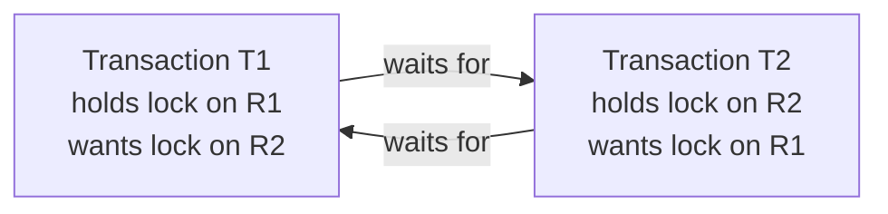

# 6. Deadlocks, Explained

## The classic mental picture

Imagine two people at a dinner table, each holding one fork, and each needing two forks to eat. Person A holds the left fork and waits for the right fork, which Person B is holding. Person B holds the right fork and waits for the left fork, which Person A is holding. Neither will ever let go voluntarily, because releasing their fork wouldn't help them eat. Both wait forever. This is the classic **dining philosophers problem**, and it's the textbook illustration of a **deadlock**.

## Formal definition

A **deadlock** is a state where two or more transactions (or processes/threads, in the general OS sense) are each waiting for a resource that another one in the group is holding, forming a **cycle** of waiting with no way out.

Concretely, in this project: T1 holds an exclusive lock on resource `R1` and calls `acquireLock` for `R2`, which T2 already holds exclusively. Meanwhile T2 calls `acquireLock` for `R1`. Both calls block forever inside `LockManager::waitForLock()` — unless something intervenes.

## The four necessary conditions (Coffman conditions)

Deadlocks in any system — not just databases — require all four of these to hold simultaneously:

1. **Mutual exclusion** — a resource can only be held by one transaction at a time (true for EXCLUSIVE locks here).
2. **Hold and wait** — a transaction holding one resource can request another without releasing what it already has (true here: 2PL's growing phase explicitly allows this).
3. **No preemption** — a resource can't be forcibly taken away from a transaction; it must be released voluntarily. (In this project, this condition is actually *violated on purpose* by the deadlock detector: it forcibly aborts a transaction to strip away its locks. That's precisely *how* the system breaks deadlocks — by breaking this condition after the fact.)
4. **Circular wait** — there's a cycle of transactions each waiting on the next.

Break any one of these four conditions and deadlock becomes impossible. Different systems pick different conditions to attack:

## Three families of solutions

| Strategy | Idea | Used in this project? |
|---|---|---|
| **Prevention** | Design the system so one of the four conditions can *never* happen (e.g., force every transaction to request all its locks at once, or always request resources in a fixed global order) | No |
| **Avoidance** | Before granting a lock, check whether doing so *could* eventually lead to a deadlock, and refuse if so (e.g., the Banker's Algorithm, which needs transactions to declare their maximum future resource needs up front — this is what the unused "claim edge" in the Resource Allocation Graph is for; see [Resource Allocation Graphs](07-resource-allocation-graphs.md)) | Only partially scaffolded (claim edges exist but are never populated) |
| **Detection + Recovery** | Let deadlocks happen, but periodically check for them, and recover by forcibly aborting a transaction to break the cycle | **Yes — this is the project's actual strategy** |

This project's approach is Detection + Recovery, implemented via two independent, redundant mechanisms that both exist in the codebase:

1. A **Resource Allocation Graph** (`ResourceAllocationGraph` in `resource_manager.cpp`) that can detect cycles among resource/transaction edges.
2. A **wait-for graph** with a background detection thread (`DeadlockDetector` in `deadlock_detector.cpp`) that periodically scans for cycles and aborts the lowest-priority transaction involved.

Both are explained in the next two documents: [Resource Allocation Graphs](07-resource-allocation-graphs.md) and [Wait-for Graphs and Victim Selection](08-wait-for-graphs-and-victim-selection.md). See [Known Issues](20-known-issues-and-inconsistencies.md) for a note on how these two mechanisms relate to each other in practice (the `DeadlockDetector`'s background thread is the one that actually resolves deadlocks automatically; the RAG's own `detectDeadlock()` method exists but nothing currently calls it periodically).

## Why detection instead of prevention?

Prevention and avoidance strategies tend to be conservative — they reject or delay lock requests even in situations that would never actually deadlock, hurting performance and throughput. Detection lets transactions run optimistically, assuming deadlocks are rare, and only pays the cost of scanning for cycles and aborting a victim when one actually occurs. Real-world databases (like PostgreSQL) generally use this same detection-based approach.

## Deadlocks vs. starvation

It's worth distinguishing deadlock from a related but different problem: **starvation**, where a transaction *could* eventually proceed, but keeps getting unlucky (e.g., it's always the one picked as the victim, or it's always outraced by other requests). This project's priority-and-backoff scheme, covered in [Wait-for Graphs and Victim Selection](08-wait-for-graphs-and-victim-selection.md), is specifically designed to reduce the risk of starvation among repeatedly-aborted transactions.

Next: [Resource Allocation Graphs](07-resource-allocation-graphs.md).
