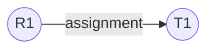
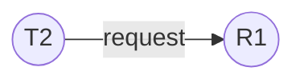
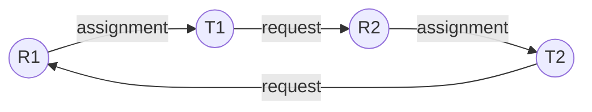

# 7. Resource Allocation Graphs (RAG)

## What it is

A **Resource Allocation Graph** is a way of drawing the current lock state of the whole system as a graph with two kinds of nodes — **transactions** (T1, T2, ...) and **resources** (R1, R2, ...) — connected by directed edges. Once drawn, a very convenient fact falls out: **if this graph contains a cycle, the system is deadlocked** (for resources like these, where each one can only be held exclusively by one transaction at a time).

This is implemented by the `ResourceAllocationGraph` class in `include/resource_manager.h` / `src/resource_manager.cpp`. Full method-by-method detail is in [the module document](12-module-resource-allocation-graph.md); this document explains the *theory* the class is built on.

## The three edge types

### 1. Assignment edge (Resource → Transaction)

Drawn when a transaction **currently holds** a lock on a resource. Read the arrow as "this resource is assigned to this transaction."

In code, added in `ResourceAllocationGraph::addAssignmentEdge(resourceId, txnId)`, called by `LockManager` every time a lock is actually granted (immediately or after waiting).

### 2. Request edge (Transaction → Resource)

Drawn when a transaction **wants** a lock on a resource but can't have it yet because it conflicts with someone else's lock. Read the arrow as "this transaction is requesting this resource."

In code, added in `ResourceAllocationGraph::addRequestEdge(txnId, resourceId)`, called by `LockManager::acquireLock()` right before a transaction starts waiting.

When the waiting transaction finally gets the lock, its request edge is converted into an assignment edge (see `LockManager::waitForLock()`, which calls `addAssignmentEdge` then `removeRequestEdge`).

### 3. Claim edge (Transaction → Resource) — declared but not currently used

A **claim edge** would represent a resource a transaction *might request in the future*, even before it actually asks for it. This is the building block of **deadlock avoidance** algorithms (like the Banker's Algorithm), which need to know every transaction's maximum possible future needs in order to refuse lock grants that could eventually lead to an unsafe state.

The methods `addClaimEdge()` / `removeClaimEdge()` exist on `ResourceAllocationGraph`, but nothing in the current codebase ever calls them — no transaction declares its future resource needs. This is scaffolding for a feature that was never finished; see [Known Issues](20-known-issues-and-inconsistencies.md).

## Putting it together: a deadlock as a cycle

Recall the dining-philosophers-style deadlock from [Deadlocks, Explained](06-deadlocks-explained.md): T1 holds R1 and wants R2; T2 holds R2 and wants R1. Drawn as a Resource Allocation Graph:

Follow the arrows: R1 → T1 → R2 → T2 → R1. That's a cycle, and it corresponds exactly to a deadlock. `ResourceAllocationGraph::detectDeadlock()` finds cycles like this using a depth-first search (implemented in the private helper `hasCycle()`), starting from every transaction that has an outstanding request edge, and following request-edge → assignment-edge chains, watching for a transaction ID that's already on the current search path.

## Why a cycle in this specific graph structure means deadlock (and when it wouldn't)

This "cycle = deadlock" shortcut is only guaranteed to be correct for resources with a **single instance** each (e.g., a single exclusive lock slot) — which matches this project's resources, since an exclusive lock only ever has one holder. If resources could have multiple interchangeable instances (e.g., a pool of 3 identical printers), a cycle in the graph would only mean deadlock is *possible*, not certain — that more general case needs a different, more careful analysis, which this project does not implement (and doesn't need to, given its single-instance resource model).

## How this fits with the rest of the system

The `ResourceAllocationGraph` is a passive record-keeper: `LockManager` calls into it every time a lock is requested, granted, released, or a transaction ends, to keep its edges accurate. Its own `detectDeadlock()` method is available to be called on demand (and is exposed through `LockManager::detectDeadlock()` and `ConcurrencyManager`'s cycle-detection surface), but the actual *automatic, periodic* deadlock detection and resolution that runs during test execution is done by a separate class, `DeadlockDetector`, which builds its own simpler **wait-for graph** instead of using this RAG. That's the subject of the next document: [Wait-for Graphs and Victim Selection](08-wait-for-graphs-and-victim-selection.md).
