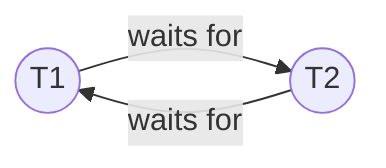
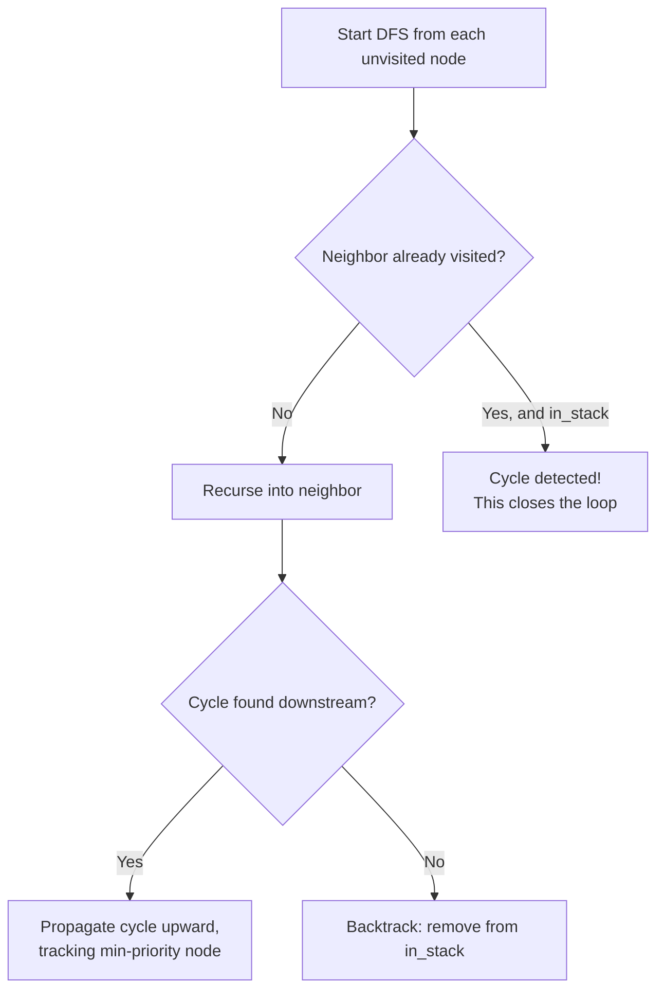

# 8. Wait-for Graphs and Victim Selection

## Wait-for graphs: a simpler cousin of the Resource Allocation Graph

A **wait-for graph** collapses the Resource Allocation Graph from [the previous document](07-resource-allocation-graphs.md) down to a graph with **only transaction nodes** — no resource nodes. There's a directed edge `T_a → T_b` whenever transaction `T_a` is waiting for *some* lock currently held by transaction `T_b`.



This is exactly what `DeadlockDetector` (in `include/deadlock_detector.h` / `src/deadlock_detector.cpp`) builds and maintains, independently of the `ResourceAllocationGraph`. The same underlying fact applies: **a cycle in the wait-for graph means a deadlock.**

### How the wait-for graph gets built

`DeadlockDetector::BuildWaitForGraph()` runs periodically (see below) and, for every resource ID it checks (`0` through `9999`, a hardcoded range — see [Known Issues](20-known-issues-and-inconsistencies.md)):

1. Asks the `LockManager` who is waiting for this resource (`getWaitingTransactions`) and who currently holds it (`getLockHolders`).
2. For every `(waiter, holder)` pair (skipping self-waits and aborted transactions), adds an edge `waiter → holder` via `AddEdge()`.

The graph is rebuilt **from scratch** every cycle — old edges are cleared first — so it always reflects a fresh snapshot rather than accumulating stale waits.

## Finding cycles: depth-first search

`DeadlockDetector::HasCycle()` looks for a cycle using a standard **depth-first search (DFS)** with two auxiliary maps:

- `visited` — has this node been explored at all, ever, during this search?
- `in_stack` — is this node currently on the *active* path being explored right now (i.e., could following edges from here lead back to itself)?

The algorithm walks the graph node by node (in sorted order, for determinism); for each unvisited node it recurses along outgoing edges. If it ever reaches a node that's already `in_stack`, that means the current path has looped back on itself — a cycle, and therefore a deadlock.



## Victim selection: who gets aborted?

Finding a cycle only tells you *that* a deadlock exists — the system still has to pick one transaction from the cycle to sacrifice (abort) in order to break it. This choice is called **victim selection**.

This project uses **priority-based victim selection**: every transaction is created with an integer `priority` (see `Transaction::getPriority()` and the `priority` parameter of `ConcurrencyManager::beginTransaction()`), and when a cycle is found, the transaction **with the lowest priority number** in that cycle is chosen as the victim.

This happens inline, during the same DFS: whenever the search finds a cycle, it compares the current node's priority against the `min_priority_txn` tracked so far and keeps whichever is lower:

```cpp
if (curr_txn && min_txn && curr_txn->getPriority() < min_txn->getPriority()) {
    min_priority_txn = node;
}
```

### Why priority, and not something else?

Common alternative victim-selection heuristics include: the transaction that has done the least work so far (cheapest to redo), the youngest transaction (started most recently), or the one holding the fewest locks. This project instead lets the *caller* assign an explicit priority number when starting a transaction, giving external control over which transactions are "important" (e.g., a bank's fraud-check transaction might be given high priority so it's never the one killed).

### Breaking the cycle and resolving repeatedly

`DeadlockDetector::RunCycleDetection()` doesn't stop at the first cycle — it loops, repeatedly calling `HasCycle()`, aborting a victim, and removing that victim from the graph, until no cycle remains. This correctly handles cases where multiple independent (or overlapping) deadlock cycles exist at once.

When a victim is chosen:

```cpp
txn->abort();                                  // mark it ABORTED
lock_manager_.releaseAllLocks(min_priority_txn); // free everything it was holding
wait_for_graph_.erase(min_priority_txn);         // remove it as a source node
// ...and strip any edges pointing at it from other nodes
```

Releasing its locks is what actually unblocks the other transactions in the cycle: their `cv.wait()` predicate inside `LockManager::waitForLock()` (see [Threads and Race Conditions](03-concurrency-threads-and-race-conditions.md)) re-checks and finds the lock now available (or finds that *it itself* was the one aborted, and gives up cleanly).

## The background thread

`DeadlockDetector`'s constructor spawns a dedicated background thread (`DetectionThread()`) that loops forever, calling `RunCycleDetection()` and then sleeping for `detection_interval_ms` (configurable; `ConcurrencyManager` defaults this to 200ms, and the metrics-focused test harness overrides it to 100ms). This means deadlocks aren't resolved *instantly* the moment they form — there's a small window (up to one detection interval) before the background thread notices and intervenes. This is a normal, deliberate trade-off in detection-based systems: checking continuously would waste CPU; checking periodically bounds the worst-case delay while keeping overhead low.

## What happens to the aborted transaction afterward: restart and backoff

Being aborted due to a deadlock isn't necessarily the end for that piece of work — in `tests/test_deadlock_detection.cpp`, a transaction whose lock request comes back with its state now `ABORTED` doesn't just give up; it **restarts from its first operation** (`i = -1` resets the loop), with its priority bumped up by one (`priority++`, making it less likely to be picked as a victim next time — a simple defense against starvation), after waiting for a randomized **exponential backoff** delay:

```cpp
int calculateBackoff(int retryCount) {
    int baseBackoff = 20;
    int maxBackoff = 5000;
    int backoff = std::min(baseBackoff * (1 << retryCount), maxBackoff); // doubles each retry
    int jitter = (std::rand() % 60) - 30;                                // ±30% randomness
    backoff = backoff * (100 + jitter) / 100;
    return std::max(backoff, 5);
}
```

The doubling (`1 << retryCount`, i.e. multiply by 2 each time) means repeatedly-conflicting transactions wait longer and longer between retries, reducing the chance they immediately collide again. The random jitter prevents multiple transactions that were aborted at the same instant from all retrying at exactly the same moment and re-colliding in lockstep (a phenomenon called the **thundering herd problem**). This retry/backoff/priority-escalation logic, and the metrics that record it, are covered in detail in [The Test Harnesses](17-test-harnesses.md) and [Metrics and Log Files](18-metrics-and-log-files.md).

Next: [Architecture Overview](09-architecture-overview.md) — now that all the theory is in place, this is where the documentation shifts fully to the actual code.
