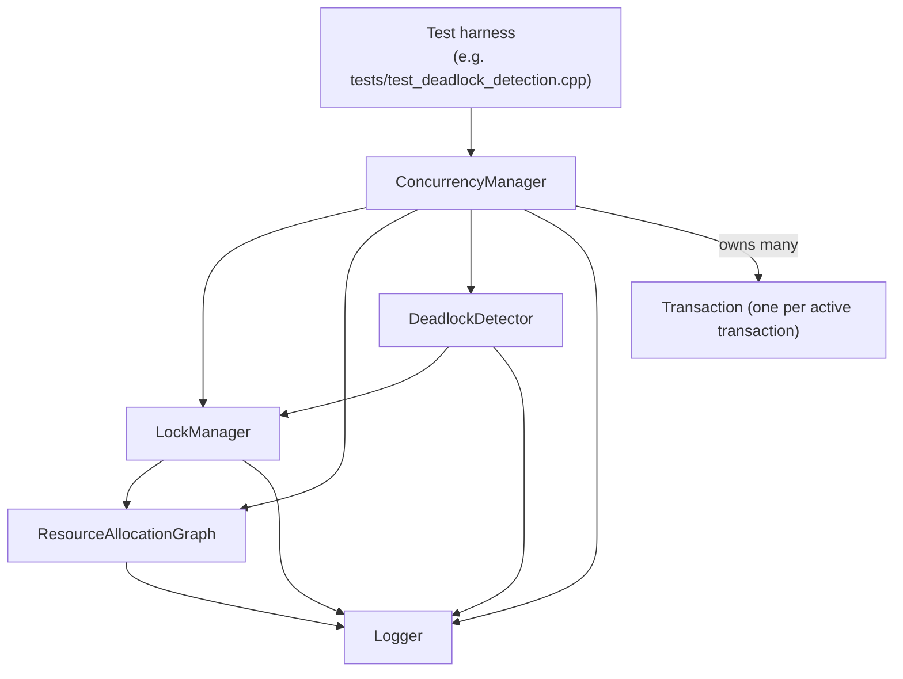
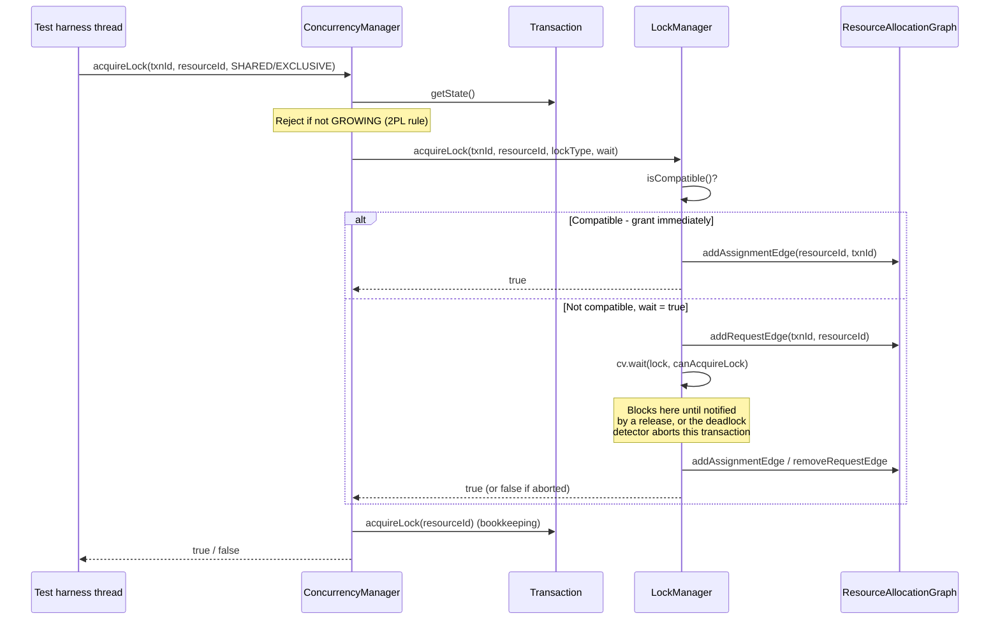
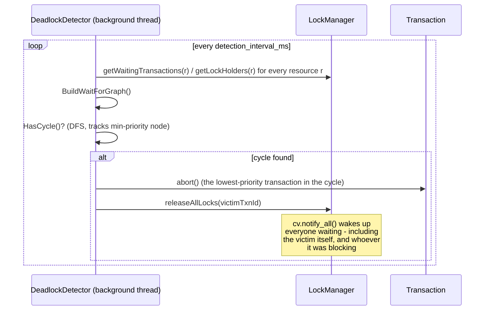

# 9. Architecture Overview

This is the map. Every box below has its own dedicated document in [Part 3 of the index](README.md); this document only shows how they connect and how a single lock request flows through all of them.

## The class ownership diagram

`ConcurrencyManager` is the single entry point that test programs talk to. It owns (or references) every other core class:

Ownership, precisely (from `ConcurrencyManager`'s member list in `include/concurrency_manager.h`):

- `LockManager lockManager;` — owned by value.
- `Logger logger;` — owned by value, and a *reference* to this same logger is threaded through to `LockManager`, `ResourceAllocationGraph`, and `DeadlockDetector`, so every component logs to the one shared log file.
- `ResourceAllocationGraph rag;` — owned by value; both `ConcurrencyManager` and `LockManager` hold a reference to this *same* instance (constructor-injected), not separate copies.
- `std::unique_ptr<DeadlockDetector> deadlockDetector;` — owned via a smart pointer so its background thread can be cleanly started in the constructor and stopped in the destructor.
- `std::unordered_map<int, std::unique_ptr<Transaction>> transactions;` — every currently-active transaction, keyed by transaction ID.

Construction order matters here (see `ConcurrencyManager`'s constructor initializer list) because each object needs a reference to ones built before it: `logger` → `rag` → `lockManager` → (then, in the constructor body) `deadlockDetector`.

## One resource, two deadlock-tracking mechanisms

A subtlety worth flagging up front (it's covered in depth in [Resource Allocation Graphs](07-resource-allocation-graphs.md), [Wait-for Graphs and Victim Selection](08-wait-for-graphs-and-victim-selection.md), and [Known Issues](20-known-issues-and-inconsistencies.md)): this codebase actually tracks *two independent graphs* that both exist to represent the same underlying deadlock information:

1. `ResourceAllocationGraph` (assignment/request/claim edges) — updated live by `LockManager` on every lock event, but its own `detectDeadlock()` is only invoked on-demand, not automatically on a timer.
2. The `DeadlockDetector`'s internal wait-for graph — rebuilt from scratch every detection cycle by polling `LockManager`, and it's *this* one whose background thread actually aborts victims automatically.

They don't share state or call into each other. In practice, the `DeadlockDetector`'s background thread is what actually keeps the system alive during a real run.

## Request flow: what happens when a transaction reads or writes data

This sequence diagram traces a single `acquireLock` call end-to-end, covering both the "granted immediately" and "must wait" cases:

Meanwhile, completely independently, on its own thread:

## Why this design keeps waiting transactions safe

A subtle but important point: when a transaction calls `LockManager::acquireLock()` and has to wait, it does **not** hold the `LockManager`'s internal mutex while sleeping — see the `lock.unlock()` call right before `waitForLock()` is invoked in `LockManager::acquireLock()`. If it held that mutex while blocked, no other thread (including the background deadlock detector, which needs the same mutex to inspect lock holders) could make any progress at all, and the system would freeze completely rather than merely have one transaction wait. This distinction — "waiting for a transaction-level lock" vs. "holding the internal mutex" — is what allows many transactions to be legitimately blocked at once while the rest of the system keeps running and the deadlock detector keeps working.

## Where to go from here

Read the module documents in the order they're used in the request-flow diagram above:

1. [`Transaction`](10-module-transaction.md)
2. [`LockManager`](11-module-lock-manager.md)
3. [`ResourceAllocationGraph`](12-module-resource-allocation-graph.md)
4. [`DeadlockDetector`](13-module-deadlock-detector.md)
5. [`ConcurrencyManager`](14-module-concurrency-manager.md)
6. [`Logger`](15-module-logger.md)
