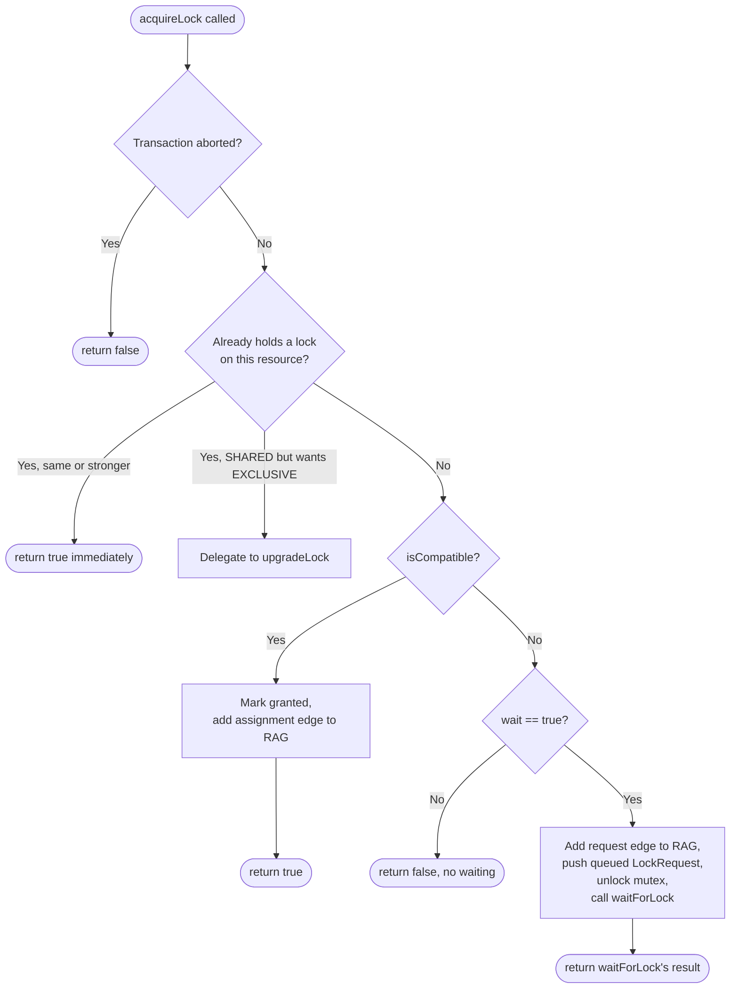

# 11. Module: `LockManager`

**Files:** `include/lock_manager.h`, `src/lock_manager.cpp`

This is the busiest, most detailed class in the project — it's the actual mechanism behind everything described in [Locks and Concurrency Control](04-locks-and-concurrency-control.md). Read that document first if you haven't.

## Core data structures

```cpp
struct LockRequest {
    int transactionId;
    LockType type;   // SHARED or EXCLUSIVE
    bool granted;     // true = currently holding it; false = still queued/waiting
};

std::unordered_map<int, std::vector<LockRequest>> lockTable; // resourceId -> list of requests (granted and waiting)
std::mutex mtx;                    // protects lockTable and waitingTransactions
Logger &logger;
std::condition_variable cv;        // used to wake up waiting transactions
std::set<int> waitingTransactions; // which transaction IDs are currently blocked somewhere
const std::chrono::milliseconds lockTimeout{5000}; // declared, but see the note below
ResourceAllocationGraph &rag;      // shared reference, kept updated on every lock event
```

Every resource's list of `LockRequest`s can contain a mix of granted entries (things currently held) and ungranted entries (things queued, waiting their turn) — they live together in the same vector, distinguished by the `granted` flag.

## `isCompatible()` — the heart of the whole class

```cpp
bool LockManager::isCompatible(int resourceId, const LockRequest& request) const {
    if (lockTable.find(resourceId) == lockTable.end()) return true; // nobody holds it -> always fine

    const auto& requests = lockTable.at(resourceId);

    if (request.type == LockType::SHARED) {
        // Fine as long as nobody holds an EXCLUSIVE lock
        return std::none_of(requests.begin(), requests.end(), [](const LockRequest& r) {
            return r.granted && r.type == LockType::EXCLUSIVE;
        });
    }

    // request.type == EXCLUSIVE: fine only if nobody *else* holds anything granted
    return std::none_of(requests.begin(), requests.end(), [&request](const LockRequest& r) {
        return r.granted && r.transactionId != request.transactionId;
    });
}
```

This is a direct implementation of the compatibility table from [Locks and Concurrency Control](04-locks-and-concurrency-control.md). Note it only ever looks at **granted** requests (`r.granted`) — queued, ungranted requests from other transactions don't block a new request from being compatible; they're just waiting their own turn.

## `acquireLock()` — the full decision tree



A few details worth calling out explicitly:

- **Re-requesting the same or a weaker lock is free.** If a transaction already holds EXCLUSIVE and asks for SHARED, that's immediately satisfied (EXCLUSIVE already implies read+write access) — no new entry is added.
- **SHARED → EXCLUSIVE re-requests become upgrades**, delegated to `upgradeLock()` (see below), not treated as a brand-new, independent lock request.
- **The mutex is released before waiting** (`lock.unlock()` right before `waitForLock(...)` is called). This is essential — see the note on this in [Architecture Overview](09-architecture-overview.md) — without it, no other thread could acquire, release, or inspect any lock while this one thread was blocked, freezing the entire system rather than just this one transaction.

## `waitForLock()` — how blocking actually works

```cpp
bool LockManager::waitForLock(int txnId, int resourceId, LockType lockType) {
    waitingTransactions.insert(txnId);

    auto canAcquireLock = [this, txnId, resourceId, lockType]() {
        Transaction* txn = Transaction::GetTransaction(txnId);
        if (txn == nullptr || txn->getState() == TransactionState::ABORTED) return true; // stop waiting if aborted
        if (lockTable.find(resourceId) == lockTable.end()) return true;
        auto it = /* find this transaction's own queued request */;
        if (it == requests.end() || it->granted) return true;
        return isCompatible(resourceId, *it);
    };

    std::unique_lock<std::mutex> lock(mtx);
    cv.wait(lock, canAcquireLock); // sleeps here until canAcquireLock() returns true
    waitingTransactions.erase(txnId);

    // ... then checks: was I aborted while I slept, or did I actually get the lock?
}
```

The predicate passed to `cv.wait` is re-evaluated every time `cv.notify_all()` fires (see `notifyWaitingTransactions()`, called from every `releaseLock`/`releaseAllLocks`). A waiting transaction wakes up, checks "am I aborted? is my request now compatible?", and if neither is true yet, goes right back to sleep. This is the standard, correct way to use a condition variable — reacting to "something changed, go re-check" rather than to a specific, narrowly-targeted signal.

**On timeouts:** the class declares `lockTimeout{5000}` (5 seconds), matching the top-level `README.md`'s claim of a "5-second timeout prevents indefinite waiting." However, `cv.wait(lock, canAcquireLock)` here is called *without* a duration — that's the indefinite-wait overload, not `cv.wait_for()`. `lockTimeout` is never referenced anywhere in `lock_manager.cpp`. In the current code, a waiting transaction is only ever released from its wait by (a) the lock becoming available, or (b) the background `DeadlockDetector` aborting it. See [Known Issues](20-known-issues-and-inconsistencies.md).

## `upgradeLock()` and `upgradeLockInternal()`

Upgrading a SHARED lock to EXCLUSIVE has its own logic because "wait for an upgrade" is subtly different from "wait for a fresh lock": the transaction already holds *something*, and while waiting to upgrade, `upgradeLockInternal()` actually removes its old SHARED entry and replaces it with a queued EXCLUSIVE request:

```cpp
if (canUpgrade) {
    it->type = LockType::EXCLUSIVE; // in place, instantly
    return true;
} else if (!wait) {
    return false;
} else {
    requests.erase(it);                          // give up the SHARED lock
    requests.push_back(LockRequest(txnId, LockType::EXCLUSIVE)); // queue for EXCLUSIVE instead
    return false; // caller must now wait (via waitForLock)
}
```

This means: while an upgrade is pending, the transaction is *not* holding any lock at all on that resource for a brief window — it gave up the shared lock to ask for the stronger one. This matches the classic "upgrade deadlock" scenario demonstrated in `tests/test1.txt`, where two transactions both hold SHARED locks on each other's target resource and both try to upgrade at once — neither can proceed, and (with the deadlock detector) one of them gets aborted to resolve it.

## `releaseLock()` and `releaseAllLocks()`

`releaseLock()` removes one transaction's granted entry for one resource, removes the corresponding assignment edge from the RAG, and then — importantly — immediately tries to grant the lock to any compatible queued request on that same resource, *before* returning:

```cpp
for (auto& req : requests) {
    if (!req.granted && isCompatible(resourceId, req)) {
        req.granted = true; // pre-grant it right here
    }
}
notifyWaitingTransactions(); // then wake everyone up to notice
```

`releaseAllLocks()` does the same, but for every resource a transaction holds at once, and it additionally has to defensively remove the transaction from *any* queue it might still be sitting in as an ungranted, waiting request (important for the abort-while-waiting case — a transaction can be aborted by the deadlock detector while it's still in someone's wait queue, never having been granted anything).

## Public "with locking" vs. `*Internal` "without locking" methods

You'll notice pairs like `holdsLock()` / `holdsLockInternal()`, `getLockType()` / `getLockTypeInternal()`, etc. The `Internal` versions assume the caller **already holds `mtx`**; the public versions acquire it themselves via `std::lock_guard`. This pattern exists because some methods (like `acquireLock()`) need to call several of these checks in sequence *without releasing the mutex in between* (to avoid another thread changing the state mid-decision) — they call the `Internal` versions directly. Public callers from outside the class always go through the locking wrappers, never the `Internal` methods.

## Full method reference

| Method | Purpose |
|---|---|
| `acquireLock` | Main entry point for requesting a lock; see decision tree above |
| `releaseLock` | Release one lock, try to grant it to a waiter, notify |
| `releaseAllLocks` | Release everything a transaction holds (used on commit/abort) |
| `holdsLock` / `getLockType` | Query current state |
| `getResourcesLockedBy` | All resources a transaction holds |
| `getLockHolders` / `getWaitingTransactions` | Used by `DeadlockDetector` to build the wait-for graph |
| `upgradeLock` | SHARED → EXCLUSIVE, in place or queued |
| `detectDeadlock` | Delegates straight to `rag.detectDeadlock()` |
| `getResourceAllocationGraph` | Delegates to `rag.toString()` |

Next: [`ResourceAllocationGraph`](12-module-resource-allocation-graph.md).
